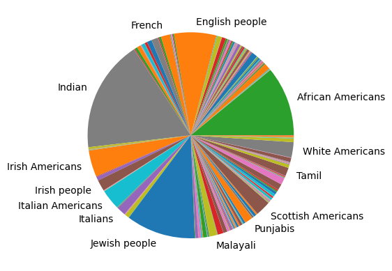
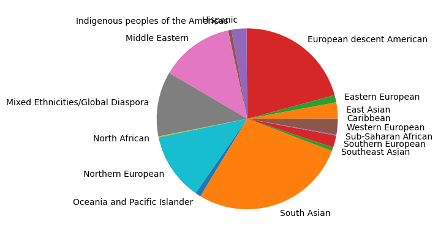
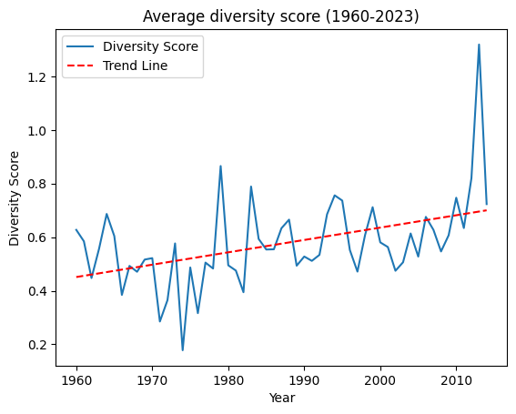

## Introduction

Movies don't just entertain—they inspire and shape how we see the world. A little girl watching a character like her become a doctor might suddenly believe she can do the same. Cinema reflects our emotions and dreams, and in doing so, it helps shape our collective imagination.

Yet, this incredible influence comes with responsibility. Films can perpetuate harmful stereotypes or amplify fear and prejudice. Worse, a lack of representation leaves entire communities invisible, excluded from the collective narrative. Thankfully, awareness of this issue has grown over the past few decades, leading to slow but meaningful progress in diversifying casts.

Today, even the Oscars have introduced diversity quotas for Best Picture eligibility, recognizing the importance of representation in storytelling. But beyond quotas and moral imperatives, there's a compelling question: can a diverse cast also drive cinematic success? Could the power of representation become a key motivator for filmmakers to embrace inclusivity? Let's dive into a data story to uncover the impact of diversity on movie success. 

     <!-- Adjust width as needed -->

## Setting the Stage

In this project, we will dive into the provided CMU Movie Summary Corpus Dataset containing 42,306 plot summaries and metadata for films released from 1893 to 2013. To define "success," we have expanded our resources, integrating data on award nominations and audience ratings.

### About Our Inspiring Datasets

    <!-- Left Side: Image -->
    

        
    

    
    <!-- Right Side: Text -->
    

        <h6>Our primary dataset provides key elements such as:</h6>
        <ul>
            <li>Movie Name</li>
            <li>Release Year</li>
            <li>Actor Ethnicity</li>
            <li>Box Office Revenue</li>
        </ul>
    

    <!-- Left Side: Text -->
    

        <h6>To enrich our analysis, we brought in additional datasets:</h6>
        <ul>
            <li>IMDb datasets for movie titles and user ratings on a 0-10 scale.</li>
            <li>Award data from globally recognized institutions like the Oscars, Golden Globes, Filmfare, and others.</li>
            <li>A mapping dataset linking Freebase IDs to Wikidata, enabling deeper insights.</li>
        </ul>
    

    
    <!-- Right Side: Image -->
    

        
    

count movie over time --> we don't take in account before 1960

### What We'll Explore

In this project, we set out to uncover how cast diversity influences both the financial and critical success of films—and the results might surprise you. Does diversity impact box office performance? To find out, we will dive into the data using linear regression to pinpoint trends while accounting for factors like movie length and release year. But the intrigue does not stop at ticket sales—what about awards? Are films with more diverse casts more likely to snag nominations for prestigious accolades like the Oscars or Golden Globes? With a little help from propensity score matching, we can compare similar films and see if diversity tips the scales or not... Lastly, let’s not forget the critics and audiences, do movies with diverse casts get higher ratings on IMDb? Through logistic regression and statistical analysis, we aim to decode these patterns. Armed with these analytical tools, we are ready to explore how representation is not always a recipe for success. The data reveals a more complex story, and we are here to share it with you.

## What Makes a Cast Inclusive?

### Clustering the Ethnicities

When we first have a look at the ethnicities, we can see that there are a total of more than 350 different ethnicities, some of them still very similar (e.g. 'Austrian American' and 'Austrian Canadian' etc). We want to first simplify this ethnicity criterion before defining diversity. If we didn’t sort the ethnicities, a film with a cast of a German, Austrian and Swiss would be considered very diverse. This is however not what we want to consider diverse. It is for this reason that the ethnicities were first grouped into larger ethnic groups. This was done with the help of a Large Language Model (LLM), with checks and corrections done by hand. Doing this by hand was still possible thanks to the manageable number of ethnicities and the LLM doing the most time-consuming part.

    <!-- Left Side: Image -->
    

        
    

    
    <!-- Right Side: Image -->
    

        
    

### Diversity Score

Once ethnicities have been categorized into larger groups (16 in total), we can begin defining diversity. Since the focus is on the diversity of the cast rather than the representation of minority groups, the country of production does not need to be taken into account.

A straightforward way to calculate diversity is to divide the number of ethnicities represented by the number of actors in the cast. However, this method is limited. For instance, in a movie with nine actors and three ethnicities, this approach would assign the same diversity score to a distribution of ethnicities such as (3,3,3) and (1,1,7).
To refine this measure, we incorporate the concept of entropy. Entropy accounts for the distribution of ethnicities within a cast. The basic formula for entropy is:

<em>S = Σ pi · ln(pi)</em>, 
where <em>pi</em> represents the proportion of the cast belonging to a particular ethnicity.

To avoid obtaining a value of zero when all actors belong to a single ethnicity, we add 1 to the entropy calculation. This ensures a more meaningful result when combining this measure with our initial diversity definition.
Finally, to balance the limitations of both methods, we multiply the entropy value by the initial diversity measure. This final diversity coefficient better captures the nuances of cast diversity, penalizing films with fewer actors while rewarding those with a more even distribution of ethnicities.

 comments

### Reflecting on the Limitations of Our Definition

Firstly, the dataset includes movies with varying numbers of actors. Films with only one actor cannot be included in the diversity calculation, as it would not provide meaningful insights into cast diversity. For a more comprehensive analysis, one could also consider whether an actor belongs to a minority group, adding another dimension to the evaluation.
Secondly, the diversity coefficient relies on the previously defined ethnic groups. Any changes to the characteristics of these groups—such as their size, number, or composition—will directly impact the diversity factor. This highlights the importance of consistent and well-defined groupings when conducting such analyses.

## Money, Ratings, Price the Ingredients of a Successful Movie

When it comes to measuring the success of a movie, we look at three main ingredients: box office revenue, user ratings, and award nominations. These criteria capture a film's financial performance, audience appreciation, and critical acclaim, giving us a well-rounded view of success.

- <h6>Box Office Revenue:</h6> To qualify as financially successful, a movie must exceed a revenue threshold of $38,119,483. This value, derived from the third quartile of the revenue distribution, ensures we are focusing on the top-performing films. Anything below this is not considered a box office hit.
- <h6>User Ratings:</h6> Films need an average rating of 7/10 or higher to make the cut. This threshold, also based on the third quartile of audience ratings, highlights movies that resonate strongly with viewers.
- <h6>Award Nominations:</h6> Success is not just about wins, but also recognition. We consider all films nominated for prestigious awards like the Oscars and Golden Globes, among others. By including nominees, we avoid being overly restrictive while still capturing critical recognition.

Together, these criteria provide a multifaceted approach to evaluating a film’s overall success—if a movie meets one or more of these benchmarks, it earns its place as a standout.

## The Cruel Truth of Data

Let us now dive into the results of our data analysis and see how diversity aligns with the overall definition of success we established. Is cast diversity more prominent in successful movies, or do less successful films lead the way? Let’s uncover the patterns and insights hidden in the data.

### Overall Succes 

hist



t test table

<!DOCTYPE html>
<html lang="en">
<head>
    <meta charset="UTF-8">
    <meta name="viewport" content="width=device-width, initial-scale=1.0">
    <title>Statistics Table</title>
    
</head>
<body>
    <table>
        <thead>
            <tr>
                <th>Statistic</th>
                <th>P-value</th>
            </tr>
        </thead>
        <tbody>
            <tr>
                <td>T-test</td>
                <td>-8.995244941826575</td>
                <td>2.659565863332736e-19</td>
            </tr>
        </tbody>
    </table>
</body>
</html>

correlation table

propensity

(pearson ou spearman)

### Let's dig in...
p-value tsble 

#### Box Office
hist + t test + Propensity Score + pearson ou spearman

#### Nominations
hist + t test + Propensity Score + pearson ou spearman

#### Ratings
hist + t test + Propensity Score + pearson ou spearman

## Conclusion

meme de omar sy triste 

## References

